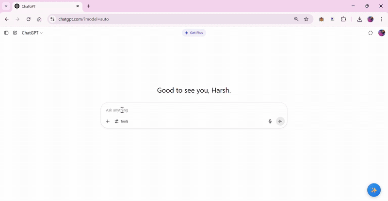

# ✨ Prompt Perfecter ✨


**Struggle to get your ideas across to AI? Wish you could instantly rephrase your text for clear, professional communication? Your personal writing assistant is here.** 🤝

Prompt Perfecter is a Chrome Extension that acts as your intelligent communication bridge. It helps you refine your text for two distinct purposes: creating crystal-clear prompts for AI models (like ChatGPT, Claude, Gemini) and rephrasing your thoughts into polished, human-readable language.

**Think of it as an empathy layer between you and your digital world. 🚀**

---

## 😵 The Problem: The Language Gap

We've all been there. You have a brilliant idea, but translating it into a prompt that an LLM truly understands can feel like wrestling a digital octopus. The results? Often generic, slightly off-topic, or just plain... *meh*. You waste time re-writing, re-phrasing, and hoping for the best.

Interacting with advanced AI is powerful, but it's only effective if the AI truly understands your intent. For many, translating thoughts into precise, grammatically correct prompts can be a major hurdle. Similarly, quickly drafting a professional message can be challenging.

The result? Your brilliant ideas get lost in translation, and you spend more time re-writing than getting results.

## 💡 The Solution: A Dual-Purpose AI Assistant

Prompt Perfecter adds a simple floating "✨" button to your favorite AI chat sites. When you click it, you don't just get one suggestion—you get two, side-by-side, each tailored for a specific goal:

<p align="center">

</p>
<p align="center"><em>🛠️ Prompt Perfecter in action – generating both an AI-optimized prompt and a Rephrased text.</em></p>

1.  **🤖 Refined for AI:** This version is meticulously structured to be an effective prompt. It clarifies your intent, corrects grammar, and formats your text so that the LLM can understand it perfectly, leading to dramatically better and more accurate responses.
2.  **👤 Rephrased for Humans:** This version focuses on improving your text for human communication. It enhances clarity, grammar, and flow, making it perfect for emails, messages, or documents. You can even adjust its tone (e.g., formal, conversational, concise) with a single click!


---

## ✅ Key Features

*   **Dual Output:** Get two distinct versions of your text—one optimized for AI, one for people.
*   **AI-Optimized Prompts:** Overcome the language barrier and unlock better results from your favorite LLMs.
*   **Human-Readable Rephrasing:** Instantly improve your writing for clarity and professionalism.
*   **On-the-Fly Tone Adjustment:** Effortlessly switch the tone of your rephrased text between formal, conversational, friendly, and more.
*   **Seamless Integration:** A simple floating button appears automatically on supported platforms.
*   **Easy Setup:** Simple popup interface to save your API key and toggle settings.
*   **Lightweight & Focused:** Does one thing and does it well!

---

## 🤖 Supported Platforms

Currently enhances prompts on:

*   ChatGPT (`chatgpt.com`)
*   Claude (`claude.ai`)
*   Google Gemini (`gemini.google.com`)
*   Grok (`grok.x.ai`)

*(Have suggestions for more? Open an issue!)*

---

## 🛠️ How It Works (Under the Hood)

1.  **Content Script (`content.js`):** Injects the floating "✨" button and the two-column results UI onto supported pages.
2.  **Popup & Options (popup.html, options.html):** Allows you to securely save your Google Gemini API key to chrome.storage.sync and enable/disable the extension.
3.  **Parallel API Calls:** When you click the button, the content script makes two simultaneous API calls to the Google Gemini API using your key, each with a specialized system prompt to generate the "AI-refined" and "Human-rephrased" versions.
4.  **Google Gemini API:** The AI brain that rewrites and improves the prompts based on the user's text and selected style.

---

## 🚀 Getting Started

As this extension isn't on the Chrome Web Store (yet!), you'll need to load it manually:

1.  **Download:** Clone this repository or download it as a ZIP file and unzip it.
    ```bash
    git clone https://github.com/hkrawal2611/Prompt-Perfecter.git
    ```
2.  **Open Chrome Extensions:** Navigate to `chrome://extensions` in your Chrome browser.
3.  **Enable Developer Mode:** Ensure the "Developer mode" toggle in the top-right corner is switched ON.
4.  **Load Unpacked:** Click the "Load unpacked" button.
5.  **Select Folder:** Browse to the directory where you cloned or unzipped the `Prompt-Perfecter` code and select the main folder (the one containing `manifest.json`).
6.  **Extension Loaded:** "Prompt Perfecter" should now appear in your list of extensions! Make sure it's enabled (toggle switch ON).

---

## 🔑 Getting Your Google Gemini API Key

Prompt Perfecter requires your personal Google Gemini API Key.

1.  **Visit Google AI Studio:** Go to [https://aistudio.google.com/app/apikey](https://aistudio.google.com/app/apikey).
2.  **Sign In:** Use your Google account.
3.  **Create API Key:** Click "Create API key in new project" (or use an existing project).
4.  **Copy Your Key:** A new key will be generated. **Copy it immediately and store it somewhere safe.** You won't be able to see the full key again!
5.  *(Optional but Recommended):* Set up API restrictions or billing alerts in the Google Cloud Console if you anticipate heavy usage beyond the free tier.

---

## ✍️ Usage

1.  **Save Your Key:** Click the Prompt Perfecter icon in your Chrome toolbar to open the popup. Paste your copied Google Gemini API key into the input field and click "Save".
2.  **Enable:** Ensure the "Enable Prompt Enhancement" toggle is ON.
3.  **Visit LLM Site:** Go to ChatGPT, Claude, etc.
5.  **Write Your Text:** Type your initial prompt idea into the chat input.
6.  **Refine!** Click the floating "✨" button that appears.
7.  **Review & Use:** A popup will show you two versions of your text.
      * Click **"Use This Prompt"** under the "Refined for AI" column to send the optimized version to the LLM.
      * Click **"Use This Text"** under the "Rephrased for Humans" column to use the polished version. You can also adjust its tone before using it.

---

## 🤝 Contributing

Contributions are welcome! Whether it's bug fixes, adding support for more LLMs, new features, or improving the enhancement logic, feel free to:

1.  Fork the repository.
2.  Create a new branch (`git checkout -b feature/your-feature-name`).
3.  Make your changes.
4.  Commit your changes (`git commit -am 'Add some feature'`).
5.  Push to the branch (`git push origin feature/your-feature-name`).
6.  Open a Pull Request.

Please open an issue first to discuss significant changes.

---

**Communicate with clarity. Perfect every prompt. Give Prompt Perfecter a try and empower your interactions with AI.**
