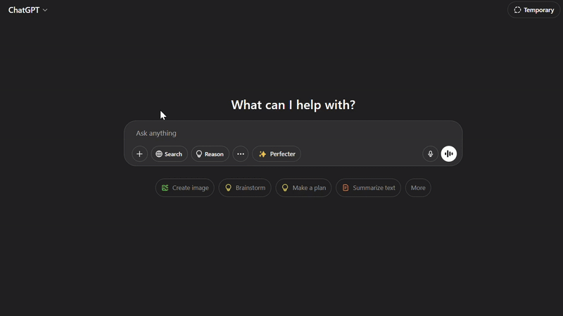

# ✨ Prompt Perfecter ✨


**Do you believe that *better prompts* unlock *better results* from your AI assistants? We do.** 🚀

If you're tired of okay-ish LLM responses and wish you could magically turn your vague ideas into laser-focused prompts, **your wish is granted!** 🧞‍♂️

Prompt Perfecter is a Chrome Extension designed to be your personal AI whisperer. It seamlessly integrates with your favorite LLMs (ChatGPT, Claude, Gemini, Grok) and uses the power of Google's Gemini API to refine and enhance your prompts *before* you even send them.

**Think of it as a turbocharger for your thoughts, ensuring every interaction starts with the best possible instruction!**

---

## 😵 The Problem: Prompt Purgatory

We've all been there. You *know* the quality of the answer depends heavily on the quality of the question, but translating a brilliant idea into a prompt an LLM truly understands can feel like wrestling a digital octopus. The results? Often generic, slightly off-topic, or just plain... *meh*. You waste time re-writing, re-phrasing, and hoping for the best.

## 💡 The Solution: Your AI Co-Pilot

Prompt Perfecter injects a simple **"✨ Perfecter"** button right into the LLM interface.

1.  **Write your draft prompt:** Just get your initial thoughts down.
2.  **Click "✨ Perfecter":** Let Prompt Perfecter work its magic! It sends your draft (and your chosen enhancement style) to the powerful Google Gemini model via *your own secure API key*.
3.  **Get Suggestions:** See the refined prompt instantly in a neat suggestion box.
4.  **Click "Use This":** Seamlessly replace your original draft with the perfected version.
5.  **Send to LLM:** Watch as the LLM delivers significantly better, more relevant, and insightful responses!

<p align="center">
  
</p>
<p align="center"><em>🛠️ Prompt Perfecter in action – enhancing prompts for better AI responses.</em></p>


---

## ✅ Key Features

*   **Seamless Integration:** Works directly within popular LLM chat interfaces.
*   **Powered by Gemini:** Leverages Google's advanced AI for high-quality prompt suggestions.
*   **User-Controlled API Keys:** **You provide your own Google AI Studio API key.** This means:
    *   **Privacy:** Your prompts (during enhancement) and key are processed via Google's API under *your* account, not stored or seen by this extension's developers.
    *   **Control:** You manage your API usage and costs (generous free tier available!).
    *   **Transparency:** No hidden backend servers.
*   **Multiple Enhancement Styles:** Choose how you want to improve your prompt:
    *   General Improvement
    *   More Specific & Detailed
    *   Concise & Clear
    *   Technical & Precise
*   **Easy Setup:** Simple popup interface to save your API key and toggle settings.
*   **Lightweight & Focused:** Does one thing and does it well!

---

## 🤖 Supported Platforms

Currently enhances prompts on:

*   ChatGPT (`chatgpt.com`)
*   Claude (`claude.ai`)
*   Google Gemini (`gemini.google.com`)
*   Grok (`grok.x.ai`)

*(Have suggestions for more? Open an issue!)*

---

## 🛠️ How It Works (Under the Hood)

1.  **Content Script (`content.js`):** Injects the "✨ Perfecter" button and suggestion UI onto supported LLM pages. Detects user clicks and grabs the current prompt text.
2.  **Popup (`popup.html`, `popup.js`, `popup.css`):** Allows users to securely save their Google Gemini API key via `chrome.storage.sync` and configure settings.
3.  **Background Script (`background.js`):** Acts as a secure intermediary. Receives requests from the content script, makes the actual API call to the Google Gemini API using the user's stored key, and sends the enhanced prompt back.
4.  **Google Gemini API:** The AI brain that rewrites and improves the prompts based on the user's text and selected style.

---

## 🚀 Getting Started

As this extension isn't on the Chrome Web Store (yet!), you'll need to load it manually:

1.  **Download:** Clone this repository or download it as a ZIP file and unzip it.
    ```bash
    git clone https://github.com/hkrawal2611/Prompt-Perfecter.git
    ```
2.  **Open Chrome Extensions:** Navigate to `chrome://extensions` in your Chrome browser.
3.  **Enable Developer Mode:** Ensure the "Developer mode" toggle in the top-right corner is switched ON.
4.  **Load Unpacked:** Click the "Load unpacked" button.
5.  **Select Folder:** Browse to the directory where you cloned or unzipped the `Prompt-Perfecter` code and select the main folder (the one containing `manifest.json`).
6.  **Extension Loaded:** "Prompt Perfecter" should now appear in your list of extensions! Make sure it's enabled (toggle switch ON).

---

## 🔑 Getting Your Google Gemini API Key

Prompt Perfecter requires your personal Google Gemini API Key.

1.  **Visit Google AI Studio:** Go to [https://aistudio.google.com/app/apikey](https://aistudio.google.com/app/apikey).
2.  **Sign In:** Use your Google account.
3.  **Create API Key:** Click "Create API key in new project" (or use an existing project).
4.  **Copy Your Key:** A new key will be generated. **Copy it immediately and store it somewhere safe.** You won't be able to see the full key again!
5.  *(Optional but Recommended):* Set up API restrictions or billing alerts in the Google Cloud Console if you anticipate heavy usage beyond the free tier.

---

## ✍️ Usage

1.  **Save Your Key:** Click the Prompt Perfecter icon in your Chrome toolbar to open the popup. Paste your copied Google Gemini API key into the input field and click "Save".
2.  **Enable:** Ensure the "Enable Prompt Enhancement" toggle is ON.
3.  **Choose Style:** Select your preferred enhancement style from the dropdown.
4.  **Visit LLM Site:** Go to ChatGPT, Claude, etc.
5.  **Write Prompt:** Type your initial prompt idea into the chat input.
6.  **Enhance!** Click the **"✨ Perfecter"** button that appears near the input.
7.  **Review & Use:** A suggestion box will pop up with the enhanced prompt. If you like it, click **"Use This"** to replace your original text.
8.  **Submit:** Send the improved prompt to the LLM!

---

## 🤝 Contributing

Contributions are welcome! Whether it's bug fixes, adding support for more LLMs, new features, or improving the enhancement logic, feel free to:

1.  Fork the repository.
2.  Create a new branch (`git checkout -b feature/your-feature-name`).
3.  Make your changes.
4.  Commit your changes (`git commit -am 'Add some feature'`).
5.  Push to the branch (`git push origin feature/your-feature-name`).
6.  Open a Pull Request.

Please open an issue first to discuss significant changes.

---

**Stop wrestling, start perfecting! Give Prompt Perfecter a try and unlock the true potential of your favorite LLMs.**
